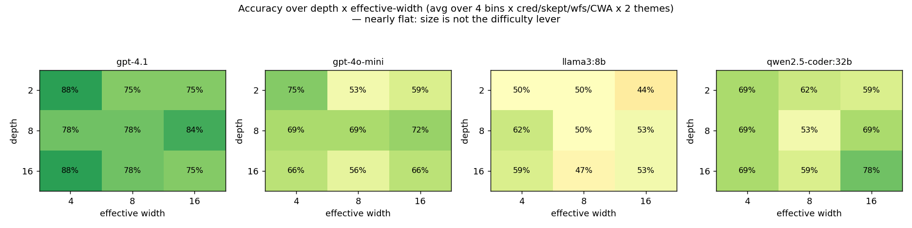

# NAF-Bench — Proof of Concept

A **solver-certified** benchmark for testing whether LLMs can *follow a specified negation semantics* instead of reverting to a default reading of "not".

This PoC validates the full proposal pipeline end-to-end and runs a **fully automated cross-vendor evaluation** of 9 models — Claude, OpenAI (incl. GPT-5), and local open-source models (DeepSeek-R1, Qwen2.5, Llama3) — to answer the central question: *do frontier models still actually have this problem?*

> **Audit revision (2026-07-02).** After an independent implementation audit (run with Fable) we fixed two correctness bugs and several statistical/design issues, **regenerated every dataset** (gold labels verified unchanged — *zero* drift; only prompt text moved), **re-ran all models** on the corrected prompts, and **retrained every LoRA adapter** on the corrected training data. What changed materially:
> - **Prompt bug fixed:** a conjunction rule was verbalized as "only if" (necessity) instead of "if" (sufficiency), affecting 12/44 of the WFS set — the *gold* was always right, the English now matches it.
> - **CIs are now clustered by program**, not by prompt: the old Wilson intervals pseudoreplicated theme/run copies of a handful of programs, so error bars are honestly wider now.
> - **"Width beats depth" is retracted:** with a bootstrap CI on the coefficient difference, neither depth nor width is a *significant* moderator — the **divergence bin (which kind of cycle) dominates**, ~10× either size axis.
> - **SFT transfer is more nuanced:** with a *genuine* held-out framing (the abstract surface is no longer in the training data), multi-verbalization SFT transfers to a held-out *narrative* theme but still collapses on the held-out *abstract* framing (see Exp 19–20).
> - Answer parsing was hardened (no more "last stray capital letter"), entity names no longer collide with the A/B/C options, and every experiment now logs completion tokens. Adopted A. Mensfelt's symmetric credulous/skeptical prompt wording.

## In plain terms

**A "negation semantics" is just a rulebook for what "not" / "unknown" means.** The same rules can give *different* answers under different rulebooks, and we test whether an LLM will use the rulebook it was told to — instead of falling back to its own default.

Everyday example. Rule: *"an order is APPROVED unless it has been flagged."* Order X — nobody said it was flagged. Is it approved?
- **Closed-world rulebook:** not stated as flagged ⇒ treat it as not flagged ⇒ **approved**.
- **Open-world rulebook:** not stated ⇒ we don't know if it's flagged ⇒ **cannot determine**.

Same sentence, two legitimate answers. The rulebooks we test are:
- **credulous** — true if it holds in *at least one* consistent scenario;
- **skeptical** — true only if it holds in *every* consistent scenario;
- **well-founded** — "undefined" when something can only be justified by circularly assuming itself;
- **closed-world** — anything not derivable is taken as false.

**What actually makes a problem hard.** Not how *long* or how *wide* the rules are, but whether the rules contain a **cycle** — statements that depend on each other through "not". Example:

> Alice attends iff Bob does NOT; Bob attends iff Alice does NOT. The meeting is held if either attends. Is the meeting held?

Alice and Bob prop each other up in a loop, so the rulebooks diverge: credulous says **yes** (someone always attends), well-founded says **cannot determine** (the loop is ungrounded). Models do fine on cycle-free problems; they trip on these loops — and that "which kind of cycle" is the dominant difficulty axis in all our experiments.

## Why this matters (motivation)

Which negation semantics you apply is not academic hair-splitting — it decides the answer in **rule-based, high-stakes domains** where "not" and "unknown" carry legal or safety weight:

- **Regulation / law.** A regulation may leave a case genuinely *undefined* (well-founded) rather than false; a court may ask whether guilt holds in *every* consistent reading (skeptical) or merely *some* reading (credulous). These are different verdicts from the *same* text.
- **Eligibility / benefits.** *"A claimant gets housing support unless they get income support, and income support unless they get housing support; a payment is due under either."* Two mutually-exclusive readings both yield a payment (credulous *yes*), but no single reading is guaranteed (skeptical *no*) — exactly our `even_both_sided` bin.
- **Fault diagnosis.** *"The sensor is faulty if the actuator is not, and vice-versa"* — a classic self-referential loop where an operational (closed-world) engine may simply not terminate.

A system that silently reverts to one default reading of "not" will be confidently wrong in all three. NAF-Bench measures precisely that: **told which rulebook to use, does the model apply it?**

**Why an *artificial* language?** The instances are synthetic on purpose. It (i) **isolates the variable** — the same certified program is re-verbalized so accuracy differences are attributable to the semantics and structure, not to topic familiarity; and (ii) **prevents data-leakage / contamination** — a model cannot have memorized an answer to a freshly generated program. Real regulatory and clinical text is ecologically valid but confounded and leak-prone; **applying these prompts to real regulatory text is the natural journal-extension / future-work step**, on top of the contamination-free synthetic core here.

This also sets us apart from existing negation work in NLP, which tests whether models *detect or understand* negation in a sentence (e.g. xNot360, Thunder-NUBench — see Related work); we instead test whether a model will **apply a specified formal negation semantics** over structured rules, with every gold answer solver-certified.

## Semantics & labels (terminology)

The four rulebooks we score against, with their synonyms and how they relate to
clingo — **brave = credulous** and **cautious = skeptical** (same concepts, two
names); clingo produces the first two, the other two are separate engines:

| our condition | a.k.a. | rule (over answer sets) | engine | zero-model case |
|---|---|---|---|---|
| **credulous** | brave | holds in **some** answer set (∃) | clingo `--enum-mode=brave` | F |
| **skeptical** | cautious | holds in **every** answer set (∀) | clingo `--enum-mode=cautious` | T (vacuous) |
| **well-founded** | WFS | 3-valued: true / false / **undefined** | our alternating-fixpoint | undefined |
| **closed-world** | SLDNF | operational; may not terminate | SWI-Prolog | loop |

- **clingo has no single "default" answer** for a query — it enumerates all
  stable models, and you then ask brave (∃) or cautious (∀). So credulous/
  skeptical *are* clingo (brave/cautious); WFS and SLDNF are the non-clingo ones.
- The subtle case is **no stable model** (our odd-cycle bin): skeptical is
  vacuously **T**, credulous is **F** — the two clingo modes disagree there.
- Every instance records all four labels plus `distinct_labels` and `odd_label`
  (which single label, if any, disagrees with the other three), so it's easy to
  see which semantics diverges on that instance.

## Interactive demo

A self-contained static site lives in [`site/`](site/) — an interactive per-model correctness panel, a `G(depth, width, bin)` explorer showing the certified four-tuple and the exact prompt per semantics, and the figure gallery. No backend is required; all data is precomputed into `site/data.js`.

## Demo examples

Every "certified" answer is computed by a real solver (clingo / well-founded fixpoint / SWI-Prolog), not by us.

### Example 1 — Same rules, one specified semantics, and 7 of 9 frontier models get it wrong

**Rules.** Node 1 is ONLINE iff Node 2 is NOT. Node 2 is ONLINE iff Node 1 is NOT. An outage alert fires only if Node 1 AND Node 2 are both online.

**Question (use well-founded semantics).** Does an OUTAGE alert fire?

The same rule set has three different certified answers depending on the named semantics:

| Stable-model semantics | Well-founded semantics | Prolog / SLDNF |
|---|---|---|
| Definitely **no** (B) | **Cannot be determined** (C) | non-termination (loop) |

Asked under **well-founded** semantics (gold = **C**), the models answer:

| Opus 4.8 | GPT-4.1 | GPT-5 | Sonnet 4.6 | Haiku 4.5 | GPT-4o-mini | Qwen2.5-32B | DeepSeek-R1 | Llama3-8B |
|---|---|---|---|---|---|---|---|---|
| **C ✓** | B ✗ | B ✗ | B ✗ | B ✗ | B ✗ | B ✗ | B ✗ | A ✗ |

Eight of nine — including GPT-5 and GPT-4.1 — get it wrong: most reason "Node 1 and Node 2 can't both be online, so the alert is impossible → Definitely no." That is classical two-valued logic; well-founded semantics says `undefined ∧ undefined = undefined`. (Only Claude Opus answers C. On the *corrected* "…fires **if** both are online" wording, even GPT-4.1 now falls for the trap.)

### Example 2 — No model assumes a closed world by default; only the strong ones can be told to

**Rules.** Item X is in category C1. An item in category C1 is APPROVED unless it has been flagged. (Nothing says X was flagged.)

**Question.** Is item X APPROVED?

All three formal semantics certify **APPROVED (A)**. Yet:

| Condition | Opus | GPT-5 | GPT-4.1 | DeepSeek-R1 | GPT-4o-mini | Qwen2.5 | Llama3 |
|---|---|---|---|---|---|---|---|
| "commonsense" (no semantics named) | C | C | C | C | C | C | C |
| **explicit** "use closed-world assumption" | A ✓ | A ✓ | A ✓ | A ✓ | C ✗ | C ✗ | C ✗ |

Every model defaults to an open-world "we weren't told whether it's flagged, so cannot determine". One sentence of instruction fixes the strong models; the smaller ones can't follow it even when told.

### Example 3 — Fixing it by training (solver-certified data → LoRA)

Same program type under WFS (gold = **C**): Alice attends iff Bob doesn't; Bob attends iff Alice doesn't; meeting held if either attends.

| Model | base | trained |
|---|---|---|
| Gemma-3-4B-it | 18/44 = 41% | 40/44 = 91% |
| Qwen2.5-7B | 26/44 = 59% | 41/44 = 93% |

Training on solver-certified data roughly doubles accuracy and fixes the divergent cases (divergent 24/24 for both trained models, in-distribution).

## What the PoC contains

```
afbench/
  program.py     ground normal logic programs + serialization to clingo/Prolog
  solvers.py     THE certification core: 3 independent semantics over one program
  generator.py   controlled generator: cycle-gadget (k=2..5) + default/stack families
  themes.py      4+ surface-form domains (verbalization-load axis)
  verbalize.py   faithful, theme-driven NL rendering + plain-English semantics
build_dataset.py  generate -> certify -> verbalize -> data/nafbench_poc.jsonl (82 items)
make_eval_set.py  stratified 24-prompt eval set (divergent probes + WFS controls + CWA)
run_eval.py       AUTOMATED harness: one OpenAI-compatible client drives ollama + OpenAI
score_all.py      combined cross-vendor scoring + data/cross_vendor_wfs.png
nafbench/parse.py + translate_solve.py + t2s_compare.py   translate-then-solve baseline
make_ladder.py + difficulty.py   difficulty-axis depth ladders + curves
nafbench/verbalize_zh.py + make_eval_set_zh.py   Chinese cross-lingual axis
make_verify_set.py + analyze_extra.py   verify-before-infer mitigation + EN/ZH plots
make_big_wfs.py + score_big.py   44-prompt scaled WFS set + 95% Wilson CIs
make_training_data.py   solver-certified SFT + DPO data (mitigation-by-training)
train_sft.py + train_dpo.py + eval_local.py   LoRA SFT/DPO + local HF eval
nafbench/instances.py + nafbench/solvers.py::certify_full   v2: G(depth,width,bin) + 4 labels + hardness
validate_v2.py + build_v2.py   v2 bin validation, hardness grid, data/nafbench_v2.jsonl
heatmap.py   9-model x 12-prompt correctness heatmap
nafbench/verbalize_v2.py + make_v2_eval.py + analyze_v2_grid.py   v2 NL + grid eval + width/depth analysis
make_v2_full.py + analyze_v2_full.py   full 4-bin grid + regression
nafbench/instances.py::build_instance + nafbench/metrics.py   G(depth, width=shared-subgoals, bin); cycle length separate + token length
make_pilot.py + analyze_pilot.py   v3 design-screening pilot
nafbench/instances.py::build_multi_independent/build_interdependent   multi-cycle gadgets
nafbench/verbalize_generic.py   transparent rule-by-rule verbalizer (label-checkable)
make_multicycle.py + analyze_multicycle.py   multi-cycle experiment (records program + n_stable_models)
make_cyclesweep.py + analyze_cyclesweep.py   cycle-length sweep
make_fewshot.py   few-shot mitigation ; analyze_reversion.py   default-reversion metric
make_headline.py + analyze_headline.py   multi-seed headline metrics with 95% Wilson CIs
tests/test_solvers.py   6 textbook cases with known answers (all pass)
data/auto_answers/      direct-reasoning answers (DeepSeek/Qwen/Llama/GPT-5/4.1/4o-mini)
data/t2s_answers/       translate-then-solve answers + the emitted programs
data/ladder_answers/    difficulty-ladder answers
data/zh_answers/        Chinese-prompt answers ; data/verify_answers/  self-verify answers
data/claude_answers.json  Claude Opus/Sonnet/Haiku answers (via subagents)
```

### The solver-certification core

Every generated program is solved under **three independent negation semantics**, all over the *same* program:

| Semantics | Engine | Verdicts |
|---|---|---|
| Stable-model (answer set) | `clingo` (Python API) | true / false / brave / no-model |
| Well-founded (3-valued) | pure Python fixpoint | true / false / undefined |
| SLDNF / Prolog NAF | `swipl` subprocess | true / false / loop |

`tests/test_solvers.py` checks these against six textbook programs. **6/6 pass**, so the gold labels are sound.

## Reproduce

```bash
pip install -r requirements.txt          # clingo + matplotlib + openai; SWI-Prolog on PATH
python tests/test_solvers.py             # 6/6 canonical cases pass
python build_dataset.py                  # 82 certified items -> data/nafbench_poc.jsonl
python make_eval_set.py                  # 24-prompt stratified eval set -> data/eval_set.json

# automated DIRECT evaluation (no manual dispatch):
python run_eval.py --provider ollama --models deepseek-r1:32b qwen2.5-coder:32b llama3:8b
OPENAI_API_KEY=... python run_eval.py --provider openai --models gpt-5 gpt-4.1 gpt-4o-mini
python score_all.py                      # -> data/cross_vendor_wfs.png

# same evaluation via the Batch APIs (50% cheaper; identical output files):
OPENAI_API_KEY=... python run_eval_batch.py --provider openai --models gpt-4o-mini o4-mini
ANTHROPIC_API_KEY=... python run_eval_batch.py --provider anthropic \
    --models claude-opus-4-8 --max-tokens 16384
# blocks until the batch ends; Ctrl-C is safe — rerunning the same command resumes.
# --submit-only submits and exits; rerun without it later to collect results.

# translate-then-solve baseline:
python translate_solve.py --provider ollama --models qwen2.5-coder:32b llama3:8b deepseek-r1:32b
OPENAI_API_KEY=... python translate_solve.py --provider openai --models gpt-5 gpt-4.1 gpt-4o-mini
python t2s_compare.py                    # -> data/direct_vs_t2s.png

# difficulty-axis ladder:
python make_ladder.py
python run_eval.py --set data/ladder_set.json --outdir data/ladder_answers \
    --provider ollama --models qwen2.5-coder:32b llama3:8b deepseek-r1:32b
python difficulty.py                     # -> data/difficulty_curves.png

# cross-lingual and verify-before-infer mitigation:
python make_eval_set_zh.py && python make_verify_set.py
python run_eval.py --set data/eval_set_zh.json --outdir data/zh_answers \
    --provider ollama --models qwen2.5-coder:32b llama3:8b
python run_eval.py --set data/verify_set.json --outdir data/verify_answers \
    --provider ollama --models qwen2.5-coder:32b llama3:8b
python analyze_extra.py                  # -> data/crosslingual_mitigation.png

# scaled WFS set with confidence intervals:
python make_big_wfs.py
python run_eval.py --set data/wfs_big.json --outdir data/big_answers \
    --provider ollama --models qwen2.5-coder:32b llama3:8b deepseek-r1:32b
python score_big.py                      # -> data/wfs_big_ci.png

# mitigation-by-training data:
python make_training_data.py             # -> data/train/{sft,dpo}.jsonl

# RUN the mitigation and evaluate:
HF_HUB_OFFLINE=1 CUDA_VISIBLE_DEVICES=6 python train_sft.py --out runs/sft
HF_HUB_OFFLINE=1 CUDA_VISIBLE_DEVICES=6 python eval_local.py --tag base
HF_HUB_OFFLINE=1 CUDA_VISIBLE_DEVICES=6 python eval_local.py --adapter runs/sft --tag sft
```

## Experiment 1 — the benchmark is discriminative, at scale

The generalized **cycle gadget** (a length-`k` negative cycle, `k∈{2,3,4,5}`, attached to the query by reach / disjunction / conjunction) plus the default-with-exception and negation-stack families, rendered across **4 themes** (meeting / panel / network / committee), produce **82 certified items**. Of these **20 are divergent** (≥2 semantics disagree); stable-vs-WFS and stable-vs-SLDNF each disagree on 20.

## Experiment 2 — automated cross-vendor evaluation (9 models)

A fixed, stratified **24-prompt eval set** is scored against solver-certified gold. It deliberately mixes divergent probes (WFS gold = *undefined*) with stratified controls (WFS gold = *true*/*false*), so a model cannot score by blindly answering "Cannot be determined".

### Headline: following WELL-FOUNDED semantics (12 prompts, gold = 6×undefined / 3×true / 3×false)

| Model | Provider | WFS accuracy |
|---|---|---|
| Claude Opus 4.8 | Claude | **12/12 (100%)** |
| GPT-5 | OpenAI | 11/12 (92%) |
| Claude Sonnet 4.6 | Claude | 11/12 (92%) |
| GPT-4o-mini | OpenAI | 9/12 (75%) |
| GPT-4.1 | OpenAI | 8/12 (67%) |
| Claude Haiku 4.5 | Claude | 7/12 (58%) |
| Qwen2.5-coder 32B | open-source | 7/12 (58%) |
| DeepSeek-R1 32B | open-source | 6/12 (50%) |
| Llama3 8B | open-source | 6/12 (50%) |

*Trivial "always-C" baseline = 6/12 (50%).*

### Condition breakdown (models run on all 24 prompts)

| Model | closed-world (explicit CWA) | stable | well-founded | CWA by default |
|---|---|---|---|---|
| GPT-5 | 3/3 | 6/6 | 11/12 | 0/3 |
| GPT-4.1 | 3/3 | 6/6 | 8/12 | 0/3 |
| GPT-4o-mini | 0/3 | 6/6 | 9/12 | 0/3 |
| DeepSeek-R1 32B | 3/3 | 5/6 | 6/12 | 1/3 |
| Qwen2.5-coder 32B | 1/3 | 6/6 | 7/12 | 0/3 |
| Llama3 8B | 1/3 | 1/6 | 6/12 | 1/3 |

### Findings

1. **Well-founded semantics is a clean capability/vendor axis.** Accuracy spans 100% (Opus) → 50% (Llama3, at the always-C baseline).
2. **Stable-model semantics is easy for most** (5–6 of 6) — except Llama3 (1/6), which mostly ignores the credulous/skeptical distinction.
3. **No model applies CWA by default.** Every model says open-world unless explicitly told otherwise.
4. **Explicit CWA repairs only stronger models.** GPT-5/4.1/DeepSeek-R1 reach 3/3; GPT-4o-mini/Qwen/Llama do not.
5. **Translation vs semantics.** Translate-then-solve lifts strong models to perfect accuracy but exposes translation fidelity as a residual bottleneck.

### Representative example — the conjunction cycle (`naf-050`)

Certified program:

```
a :- not b.   b :- not a.   q :- a, b.
   stable -> FALSE      well-founded -> UNDEFINED      SLDNF -> LOOP
```

Verbalization:

> Node 1 is ONLINE iff Node 2 is NOT. Node 2 is ONLINE iff Node 1 is NOT. An outage alert fires if Node 1 is ONLINE and Node 2 is ONLINE.

Only Opus 4.8 and GPT-4.1 answer the certified WFS verdict `C`; the others answer `B`.

### Representative example — closed-world default-reversion (`naf-000`)

Certified `approved = TRUE` under all three semantics:

```
in_c1.   approved :- in_c1, not flagged.
```

Most models answer `C` under commonsense prompting; only strong models switch to `A` under an explicit closed-world instruction.

## Experiment 3 — translate-then-solve baseline

Asking the model to translate the rules into a logic program and letting the certified solver apply the semantics isolates translation from semantic following.

| Model | direct WFS | translate-then-solve WFS | T2S overall | programs parsed |
|---|---|---|---|---|
| GPT-5 | 11/12 | 12/12 | 24/24 | 12/12 |
| GPT-4.1 | 8/12 | 12/12 | 24/24 | 12/12 |
| Claude Opus 4.8 | 12/12 | 11/12 | 21/24 | 12/12 |
| GPT-4o-mini | 9/12 | 11/12 | 22/24 | 11/12 |
| Qwen2.5-coder 32B | 7/12 | 9/12 | 15/24 | 12/12 |
| DeepSeek-R1 32B | 6/12 | 11/12 | 16/24 | 11/12 |
| Llama3 8B | 6/12 | 9/12 | 14/24 | 12/12 |

The strong translators are perfect under solver delegation; the remaining errors are mostly translation fidelity.

## Experiment 4 — difficulty axes

`make_ladder.py` builds single-axis sweeps for negation depth and rule depth.

- Nested-negation depth is a clean capacity limit: every model except Llama3-8B tracks parity out to depth 8.
- Rule-depth under explicit CWA is harder for mid models and shows capability-bound CWA failures rather than pure length effects.

## Experiment 5 — cross-lingual and mitigation

Chinese prompts are generated by `nafbench/verbalize_zh.py`. `make_verify_set.py` adds a prompt-only verify-before-infer scaffold.

The failure is language-robust: GPT-5 stays identical EN/ZH, GPT-4.1 and GPT-4o-mini lose a little, Qwen improves in Chinese, and Llama3 drops.

A verification scaffold lifts weak models (Llama3 from 5/12 to 11/12) while leaving strong models neutral.

## Experiment 6 — scaled WFS set with confidence intervals

A 44-prompt WFS set (24 divergent, 20 controls) shows the failure is specific to undefined cases.

| Model | overall | divergent | controls |
|---|---|---|---|
| GPT-5 | 31/44 = 70% | 11/24 = 46% | 20/20 |
| GPT-4o-mini | 31/44 = 70% | 16/24 = 67% | 15/20 |
| Qwen2.5-coder 32B | 27/44 = 61% | 13/24 | 14/20 |
| Llama3 8B | 27/44 = 61% | 11/24 | 16/20 |
| GPT-4.1 | 26/44 = 59% | 10/24 | 16/20 |
| DeepSeek-R1 32B | 16/44 = 36% | 2/24 | 14/20 |

Strong models are near-perfect on controls but struggle on divergent undefined cases.

## Experiment 7 — training data generator

`make_training_data.py` produces solver-certified SFT and DPO examples:
- 271 SFT examples with certified reasoning targets.
- 16 DPO preference pairs.
- leakage guard: eval-set-like prompts held out.

## Experiment 8 — mitigation by training

LoRA SFT on certified data recovers near-perfect WFS performance on held-out items.

| Model | base | +SFT | +SFT+DPO |
|---|---|---|---|
| gemma-3-4b-it | 41% | 89% | — |
| qwen2.5-7b | 57% | 92% ± 3% | 95% |

Divergent accuracy reaches 96–100%, showing the certifier can generate repair data.

A thinking-model probe (Qwen3.5-9B, 2048-token budget) shows SFT lifts controls (5/20 → 18/20) and partly recovers divergent cases (0/24 → 14/24, i.e. 0% → 58%), suggesting the next step is think-block-aware targets.

## Experiment 9 — v2 parametrization

The generator now supports G(depth, width, divergence_bin) and four semantic labels: credulous, skeptical, WFS, SLDNF.

Four divergence bins are validated:
- control: (T,T,T,T)
- even cycle one-sided: (T,F,u,loop)
- odd cycle: (F,T,u,loop)
- even cycle both-sided: (T,T,u,loop)

Solver hardness is recorded via Prolog inferences and clingo conflicts/choices.

## Experiment 10 — v2 grid

A 75-prompt grid across depth and width for the even-one-sided bin shows:
- GPT-5/GPT-4.1: 100%
- GPT-4o-mini: 56%
- Qwen2.5: 51%
- Llama3: 32%

Depth vs width is **not** a significant difference for non-saturated models
(`b_depth = −0.035`, `b_width = −0.044`; bootstrap 95% CI on `|b_width|−|b_depth|`
= [−0.072, +0.084], **includes 0**). The earlier "width beats depth" reading was
a bare point-estimate comparison and does not survive uncertainty.

## Experiment 11 — full v2 grid

A 324-prompt grid evaluated on four models shows bin type dominates, with depth ≈ width when width is shared subgoals.

## Experiment 12 — v3 pilot

The pilot records token length to control length confounds.

Key design decisions:
- fix cycle lengths to even=4 and odd=3;
- keep all five conditions (credulous, skeptical, WFS, closed-world, no-instruction);
- record and control token length;
- **width = shared subgoals only, with cycle length as a separate per-bin knob**
  (revised per A. Mensfelt: tracking shared subgoals and resolving a negative
  cycle are different loads, and a cycle's parity is already fixed by the bin, so
  folding cycle length into "width" conflated two axes). The grid below sweeps
  plain width, identical across bins.

## Experiment 13 — formal v3 run (plain-width grid, local models)

360 prompts over the depth × **plain width** grid (depth ∈ {2, 8, 16}, width =
shared subgoals ∈ {0, 4, 8}, identical across bins; cycle length is a separate
per-bin knob). Following the agreed plan, the grid is run with the **local
models** (the frontier models sit near ceiling on the divergent probes and are
run at the fixed production size instead).

Semantic-following accuracy (excl. no-instruction): Qwen2.5-coder 32B 67%,
DeepSeek-R1 32B 56%, Llama3-8B 50%.

Reverting width to shared-subgoals-only did **not** change the conclusion: depth
and width are both negligible moderators (standardized `z(depth) = −0.024`,
`z(width) = −0.006`; with length controlled, −0.16 and −0.10), while the
**divergence bin dominates** (bin coefficients −0.42 to −0.63, ~20–80× the size
coefficients). Accuracy is essentially independent of depth *and* width.

Accuracy over the depth × width grid (per model) is nearly flat (Qwen cells
59–75%, DeepSeek 44–69%, Llama3 47–56%) — visual confirmation that size is not
the difficulty lever (`make_heatmap_dw.py`):



## Experiment 14 — length vs structure

Length-matched padding shows pure length hurts little, while structure hurts a lot.

## Experiment 15 — extended ranges to 32

The 32-range run (depth and plain width pushed to 32, three local models)
confirms the divergence bin still dominates. Without length control, depth and
width are indistinguishable moderators (`|width|−|depth|` bootstrap CI includes
0) and both are tiny (≈ ±0.02) next to the bin coefficients (−0.43 to −0.47);
accuracy stays flat. (Controlling for length, depth edges width slightly, but
that is token collinearity — deeper/wider instances have more tokens — and both
remain dwarfed by the bin.) On the earlier full-panel folded-width run the
frontier was near ceiling (GPT-5 100%, Opus 100% slice).

## Experiment 16 — further probes

- Reversion rates on conflict items (v3 grid): Llama3 54%, GPT-4o-mini 37%, Qwen 29%, GPT-4.1 28%.
- Cycle length has a weak effect; interdependent multi-cycle structure is harder.
- Few-shot mitigation strongly helps mid models.

## Experiment 17 — headline metrics with CIs

A balanced set with **program-clustered** 95% CIs (bootstrap over the 9 distinct
programs, not the theme/run replicates) shows:
- default-semantics reversion: GPT-4.1 21% [8–38], GPT-4o-mini 24% [13–34],
  Qwen 16% [10–21], **Llama3 59% [45–71]** — the frontier reverts far less.
- closed-world is the hardest condition even for GPT-4.1.

**Token cost** (mean completion tokens per item on this set; the harness now logs
tokens *used*, not just the answer): GPT-4.1 695, GPT-4o-mini 517, Qwen 428,
Llama3 325 — closed-world costs the most across models. (GPT-5's reasoning
overhead, ~2.5k tokens/item, shows up on the sets it was run on.)

## Experiment 18 — generalization across verbalization (memorization check)

Per the UK team's concern that testing on the *same* phrasing used for training
rewards memorization, the **same certified programs** are rendered in two very
different framings, **both held out of the LoRA training** (which uses narrative
themes 0,1): **A = narrative theme 2** (a reviewer/audit surface not trained on)
and **B = abstract** ("proposition X is true if proposition Y is not true"). The
dataset also records each instance's `distinct_labels`/`odd_label`, and the
harness logs the **completion tokens used**, not just the answer.

| Model | narrative (A, 9) | abstract (B, 9) | few-shot transfer* |
|---|---|---|---|
| GPT-5 | 100% | 100% | 100% |
| GPT-4.1 | 100% | 100% | 89% |
| Qwen2.5-coder 32B | 78% | 78% | 78% |
| GPT-4o-mini | 56% | 56% | 67% |
| Llama3-8B | 44% | 44% | **67%** |

\* narrative exemplar in front of an abstract (framing B) question.

- **Frontier models are verbalization-robust** (GPT-5 100/100, GPT-4.1 100/100) —
  genuine competence, not memorized phrasing.
- **Weak/mid models are phrasing-dependent** and near a floor on these divergent
  probes, so cross-verbalization testing is necessary (a single-phrasing
  benchmark would mis-rank them).
- **The few-shot fix helps the weak models transfer** (narrative exemplar →
  abstract test lifts Llama +23, GPT-4o-mini +11): the exemplar teaches the
  semantics, not the surface.

## Experiment 19 — does the SFT gain transfer to a new verbalization? (no)

The strongest form of the memorization check: take the LoRA adapter trained on
the **narrative** framing (Exp. 8) and evaluate it on the **abstract** framing of
the same 44-prompt WFS set (`make_wfs_generic.py`; adapter reused, no retraining).

| Gemma-3-4B-it | trained framing (narrative) | unseen framing (abstract) |
|---|---|---|
| base | 18/44 | 30/44 |
| + LoRA SFT | **40/44 (+22)** | **28/44 (−2)** |

The SFT gain is **specific to the training phrasing**: it nearly saturates the
trained narrative framing (+22) but does not transfer to the abstract one and
slightly hurts (controls collapse 6→4 / 20 as the adapter over-emits
"undefined"). This validates the concern directly and argues that the mitigation
must be trained *across* verbalizations, not one. (The prompt-only fixes behave
better — Exp. 18 shows few-shot transfers across framings.)

## Experiment 20 — training across verbalizations improves transfer

Direct follow-up to Exp. 19: instead of one phrasing, the SFT data renders each
certified (program, condition) in **two narrative surfaces** (v2 themes 0,1) with
a framing-agnostic certified rationale (`make_sft_multi.py`, 128 examples). We
then test on framings **genuinely held out of training** — a *third* narrative
theme (theme 2) *and* the abstract surface — both at a larger held-out size
(audit finding #4: previously the abstract framing was itself in the training
data, which inflated the transfer claim).

| Gemma-3-4B-it | held-out narrative (theme-2, 12) | held-out abstract set (44) |
|---|---|---|
| base | 5/12 | 30/44 |
| single-verbalization SFT (Exp. 19) | 3/12 | 28/44 |
| **multi-verbalization SFT** | **7/12** | 24/44 (collapses to all-C) |

The honest, corrected picture is **split**:
- **Transfer to a held-out *narrative* surface works.** Multi-verbalization SFT
  (7/12) beats both base (5/12) and single-verbalization SFT (3/12) — training on
  two narrative surfaces generalizes to a third, whereas one surface *hurts*
  (memorization).
- **Transfer to a structurally-different *abstract* framing does not.** Once the
  abstract surface is truly held out, the multi-verbalization adapter collapses
  to answering "undefined" everywhere (24/44, controls 0/20) — *worse* than base.
  The earlier "24→28, collapse undone" result was an artifact of the abstract
  framing being present in training.

Takeaway: verbalization diversity in training buys transfer within a *family* of
surfaces (narrative→narrative) but not across a large representational gap
(narrative→abstract). The mitigation needs training framings that span the
representational range it will be tested on — more surfaces, including abstract
ones, not just more narrative themes.

## Experiment 21 — production run (open-source panel)

The production design agreed with A. Mensfelt: a fixed cell (**depth 8, width 4**,
cycle even=4/odd=3), one verbalization, and **30 *distinct* programs per cell** —
structurally varied but gold-preserving (`nafbench/instances.build_variant`:
varied cq/wide attach points, aggregator count, support-fact distribution, cycle
guard literals, rule order; isomorphic duplicates filtered). 600 prompts = 4 bins
× 30 distinct programs × 5 conditions (120 programs), rendered rule-by-rule so the
structural variety shows in the language. CIs are clustered over the ~110 distinct
programs per model/condition — a real improvement over the pilots' handful.

OpenAI budget was exhausted, so this run is the **open-source panel only**
(`run_production.sh`, single pass, T=0):

| Model | credulous | skeptical | well-founded | closed-world | default-reversion |
|---|---|---|---|---|---|
| Qwen2.5-coder 32B | 72% [64,81] | 61% [52,69] | 74% [66,82] | 59% [51,69] | 30% [25,34] |
| Llama3-8B | 62% [54,71] | 67% [59,75] | 36% [27,44] | 31% [23,40] | 61% [53,69] |
| DeepSeek-R1 32B | 72% [64,81] | 64% [55,74] | 31% [23,39] | 43% [34,52] | 32% [26,39] |

DeepSeek-R1 needed a **reasoning-model answer extractor**
(`nafbench/answer.parse_answer_reasoning`, applied by `rescue_deepseek.py`): the
strict parser resolved only 110/600 because R1 ignores "ANSWER: X" and concludes
in its own format (`\boxed{q}`, "q is undefined", …). Re-parsing the *saved* raw
outputs (no re-run) — mapping the free-form conclusion about the query to A/B/C,
and verified to agree with the strict parser on all items it had already resolved
— lifts coverage to 536/600. Notably R1 does *worst* on well-founded (31%): a
reasoning model tends to force a definite true/false rather than "undefined".

Frontier models (GPT-4.1/GPT-5, Claude) are pending API budget.

## Experiment 22 — rule-order robustness

A semantics-preserving perturbation: take a program and present its rules in
several **different orders**. Reordering never changes the logic, so the certified
gold is invariant within a group — any change in the model's answer across orders
is pure order-sensitivity. Production scale: 4 bins × 10 distinct programs × 4
conditions × 4 rule orderings = 640 prompts over **160 (program, condition)
groups** (`make_reorder_prod.py`; scored by `analyze_reorder_prod.py`;
`data/reorder_prod_set.json`, `data/reorder_prod_answers/`).

| Model | accuracy | order-sensitivity (groups whose answer flips with rule order) |
|---|---|---|
| Qwen2.5-coder 32B | 68% | 87/160 = **54%** |
| Llama3-8B | 48% | 99/160 = **62%** |
| DeepSeek-R1 32B | 55% | 106/158 = **67%** |

All three open-source models change their answer on **more than half** of the
groups purely from reordering identical rules — a substantial robustness gap under
a perturbation they should be invariant to. (DeepSeek-R1 scored via the reasoning
extractor, coverage 556/640.) Frontier models on this set are pending API budget.

## Related work (positioning)

Two recent papers study reasoning failure as a function of **raw complexity**:
**ZebraLogic** (Lin et al., arXiv:2502.01100) — logic-grid CSPs with a "curse of
complexity" accuracy collapse as size grows; and **The Illusion of Thinking**
(Shojaee et al., arXiv:2506.06941) — reasoning models collapse beyond a
complexity threshold, with effort declining near collapse. NAF-Bench is
**complementary and distinct**: (i) our difficulty is *not* raw size — depth/width
are flat to 32 (Exp. 13–15) — but *which negation semantics + cycle structure* is
specified; (ii) every instance is **solver-certified under four different
rulebooks**, whereas those benchmarks have a single answer key; and (iii) our
central metric is **default-reversion** (does the model switch rulebook when
told), not scaling accuracy. Our DeepSeek-R1 non-convergence on cyclic items
echoes "Illusion of Thinking", and our few-shot / self-verify / translate-then-
solve fixes parallel their best-of-N / self-verification probes.

A separate NLP line benchmarks whether LLMs **detect or understand** negation at
the sentence level: **xNot360** (Nguyen, Goebel, Toni, Stathis, Satoh,
arXiv:2306.16638) finds GPTs only modestly proficient at spotting when one
sentence negates another, and **Thunder-NUBench** (So et al., EACL 2026 Findings)
contrasts negation against contradiction/paraphrase for sentence-level
understanding. NAF-Bench targets a different competence: not *detecting* negation
in prose, but **applying a specified formal negation semantics** to structured
rules whose answer legitimately depends on which semantics is named.

Most directly related is **ASPBench** (Ren et al., arXiv:2507.19749), which
benchmarks 14 LLMs on Answer Set Programming — ASP entailment, answer-set
verification, and answer-set computation — and finds models handle the first two
but **struggle to actually compute answer sets**. NAF-Bench is complementary:
ASPBench measures ASP task-solving broadly, whereas we hold the program fixed and
ask whether a model will *follow a specified* negation semantics when several
legitimate ones (credulous / skeptical / well-founded / SLDNF) diverge on the
same rules — with every item solver-certified under all four.

## Takeaway

The project is now end-to-end: certified failure detection, controlled benchmark generation, cross-vendor evaluation, prompt and translation baselines, cross-lingual tests, and a working training mitigation. The remaining work is the final wording on the subtle semantics and the scale of the full production run.
