# NAF-Bench — Proof of Concept

A **solver-certified** benchmark for testing whether LLMs can *follow a specified
negation semantics* instead of reverting to a default reading of "not".

This PoC validates the full proposal pipeline end-to-end and runs a **fully
automated cross-vendor evaluation** of 9 models — Claude, OpenAI (incl. GPT-5),
and local open-source models (DeepSeek-R1, Qwen2.5, Llama3) — to answer the
central question: *do frontier models still actually have this problem?*

## Interactive demo (static, Cloudflare-Pages ready)

A self-contained static site lives in [`site/`](site/) — an interactive
per-model correctness panel, a `G(depth, width, bin)` explorer showing the
certified four-tuple and the exact prompt per semantics, and the figure gallery.
No backend (all data precomputed into `site/data.js`). Rebuild with
`python build_site.py`; deploy by pointing Cloudflare Pages at the `site/`
directory (see [`site/README.md`](site/README.md)).

## Demo examples (meeting-ready)

Three self-contained slides. Every "certified" answer is computed by a real
solver (clingo / well-founded fixpoint / SWI-Prolog), not by us.

### Example 1 — Same rules, one specified semantics, and 7 of 9 frontier models get it wrong

> **Rules.** Node 1 is ONLINE if and only if Node 2 is NOT. Node 2 is ONLINE if
> and only if Node 1 is NOT. An outage alert fires **only if Node 1 AND Node 2
> are both online**.
> **Question (use well-founded semantics).** Does an OUTAGE alert fire?

The *same* rule set has three different certified answers depending on the
negation semantics named in the prompt:

| Stable-model semantics | Well-founded semantics | Prolog / SLDNF |
|---|---|---|
| Definitely **no** (B) | **Cannot be determined** (C) | non-termination (loop) |

Asked under **well-founded** semantics (gold = **C**), the models answer:

| Opus 4.8 | GPT-4.1 | GPT-5 | Sonnet 4.6 | Haiku 4.5 | GPT-4o-mini | Qwen2.5-32B | DeepSeek-R1 | Llama3-8B |
|---|---|---|---|---|---|---|---|---|
| **C ✓** | **C ✓** | B ✗ | B ✗ | B ✗ | B ✗ | B ✗ | B ✗ | B ✗ |

Seven of nine — **including GPT-5** — reason *"Node 1 and Node 2 can't both be
online, so the alert is impossible → Definitely no."* That is **classical
two-valued logic**; well-founded semantics says `undefined ∧ undefined =
undefined`. Only Opus 4.8 and GPT-4.1 follow the semantics they were told to use.

The full 9-model × 12-prompt picture under well-founded semantics (green =
correct, red = wrong, cell = the model's answer, `[.]` = gold):

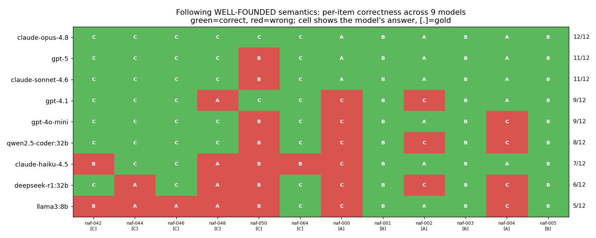

### Example 2 — No model assumes a closed world by default; only the strong ones can be told to

> **Rules.** Item X is in category C1. An item in category C1 is APPROVED
> **unless it has been flagged.** *(Nothing says X was flagged.)*
> **Question.** Is item X APPROVED?

All three formal semantics certify **APPROVED (A)** — "flagged" can't be derived,
so by negation-as-failure it's false. Yet:

| Condition | Opus | GPT-5 | GPT-4.1 | DeepSeek-R1 | GPT-4o-mini | Qwen2.5 | Llama3 |
|---|---|---|---|---|---|---|---|
| "commonsense" (no semantics named) | C | C | C | C | C | C | C |
| **explicit** "use closed-world assumption" | A ✓ | A ✓ | A ✓ | A ✓ | C ✗ | C ✗ | C ✗ |

**Every** model defaults to an open-world *"we weren't told whether it's flagged,
so cannot determine"* — none applies the closed-world assumption on its own. One
sentence of instruction fixes the strong models; the smaller ones **can't follow
it even when told**.

### Example 3 — Fixing it by training (solver-certified data → LoRA)

Same kind of program ("Alice attends iff Bob doesn't; Bob iff Alice doesn't;
the meeting is held if either attends" — under WFS, gold = **C**):

| Gemma-3-4B-it | answer on this item | WFS accuracy (held-out 44 prompts) |
|---|---|---|
| base | "Definitely no" (B) ✗ | 18/44 = 41% |
| **+ LoRA SFT on solver-certified data** | "Cannot be determined" (C) ✓ | **39/44 = 89%** |

Training on certifier-generated chains-of-thought roughly **doubles** accuracy
and fixes the divergent cases (38% → 96%) — and the same recipe takes Qwen2.5-7B
from 57% → **95%** (divergent → 100%, stable across 3 seeds). The certifier both
*finds* the failure and *generates the data to fix it*. (Plots:
`data/cross_vendor_wfs.png`, `data/direct_vs_t2s.png`, `data/train_summary.png`.)

## What the PoC contains

```
nafbench/
  program.py     ground normal logic programs + serialization to clingo/Prolog
  solvers.py     THE certification core: 3 independent semantics over one program
  generator.py   controlled generator: cycle-gadget (k=2..5) + default/stack families
  themes.py      4+ surface-form domains (verbalization-load axis)
  verbalize.py   faithful, theme-driven NL rendering + plain-English semantics
build_dataset.py  generate -> certify -> verbalize -> data/nafbench_poc.jsonl (82 items)
make_eval_set.py  stratified 24-prompt eval set (divergent probes + WFS controls + CWA)
run_eval.py       AUTOMATED harness: one OpenAI-compatible client drives ollama + OpenAI
score_all.py      combined cross-vendor scoring + data/cross_vendor_wfs.png
nafbench/parse.py + translate_solve.py + t2s_compare.py   translate-then-solve baseline
make_ladder.py + difficulty.py   difficulty-axis depth ladders + curves
nafbench/verbalize_zh.py + make_eval_set_zh.py   Chinese cross-lingual axis
make_verify_set.py + analyze_extra.py   verify-before-infer mitigation + EN/ZH plots
make_big_wfs.py + score_big.py   44-prompt scaled WFS set + 95% Wilson CIs
make_training_data.py   solver-certified SFT + DPO data (mitigation-by-training)
train_sft.py + train_dpo.py + eval_local.py   LoRA SFT/DPO + local HF eval
nafbench/instances.py + nafbench/solvers.py::certify_full   v2: G(depth,width,bin) + 4 labels + hardness
validate_v2.py + build_v2.py   v2 bin validation, hardness grid, data/nafbench_v2.jsonl
heatmap.py   9-model x 12-prompt correctness heatmap
nafbench/verbalize_v2.py + make_v2_eval.py + analyze_v2_grid.py   v2 NL + grid eval + width/depth analysis
make_v2_full.py + analyze_v2_full.py   full 4-bin grid + regression
nafbench/instances.py::build_by_effwidth + nafbench/metrics.py   effective-width (cycle folded in) + token length
make_pilot.py + analyze_pilot.py   v3 design-screening pilot
nafbench/instances.py::build_multi_independent/build_interdependent   multi-cycle gadgets
nafbench/verbalize_generic.py   transparent rule-by-rule verbalizer (label-checkable)
make_multicycle.py + analyze_multicycle.py   multi-cycle experiment (records program + n_stable_models)
make_cyclesweep.py + analyze_cyclesweep.py   cycle-length sweep
make_fewshot.py   few-shot mitigation ; analyze_reversion.py   default-reversion metric
tests/test_solvers.py   6 textbook cases with known answers (all pass)
data/auto_answers/      direct-reasoning answers (DeepSeek/Qwen/Llama/GPT-5/4.1/4o-mini)
data/t2s_answers/       translate-then-solve answers + the emitted programs
data/ladder_answers/    difficulty-ladder answers
data/zh_answers/        Chinese-prompt answers ; data/verify_answers/  self-verify answers
data/claude_answers.json  Claude Opus/Sonnet/Haiku answers (via subagents)
```

### The solver-certification core (the part that had to work)

Every generated program is solved under **three independent negation semantics**,
all over the *same* program:

| Semantics | Engine | Verdicts it can produce |
|---|---|---|
| Stable-model (answer set) | `clingo` (Python API) | true / false / brave (model-dependent) / no-model |
| Well-founded (3-valued) | alternating fixpoint, pure Python (Van Gelder) | true / false / **undefined** |
| SLDNF / Prolog NAF | `swipl` subprocess | true / false / **loop** (non-termination) |

`tests/test_solvers.py` checks these against six textbook programs (Tweety, odd
loop `p:-not p`, even loop, constraint-via-cycle, …). **6/6 pass**, so the gold
labels the benchmark rests on are sound. The structural fact the benchmark
exploits: the *same* program yields *different* certified verdicts across
semantics, e.g.

```
a :- not b.   b :- not a.   q :- a, b.    ("dispute filed only if BOTH attend")
   stable -> FALSE      well-founded -> UNDEFINED      SLDNF -> LOOP
```

## Reproduce

```bash
pip install -r requirements.txt          # clingo + matplotlib + openai; SWI-Prolog on PATH
python tests/test_solvers.py             # 6/6 canonical cases pass
python build_dataset.py                  # 82 certified items -> data/nafbench_poc.jsonl
python make_eval_set.py                  # 24-prompt stratified eval set -> data/eval_set.json

# automated DIRECT evaluation (no manual dispatch):
python run_eval.py --provider ollama --models deepseek-r1:32b qwen2.5-coder:32b llama3:8b
OPENAI_API_KEY=... python run_eval.py --provider openai --models gpt-5 gpt-4.1 gpt-4o-mini
python score_all.py                      # -> data/cross_vendor_wfs.png

# translate-then-solve baseline (model translates; solver applies semantics):
python translate_solve.py --provider ollama --models qwen2.5-coder:32b llama3:8b deepseek-r1:32b
OPENAI_API_KEY=... python translate_solve.py --provider openai --models gpt-5 gpt-4.1 gpt-4o-mini
python t2s_compare.py                    # -> data/direct_vs_t2s.png

# difficulty-axis ladder (nested-negation depth, rule depth):
python make_ladder.py
python run_eval.py --set data/ladder_set.json --outdir data/ladder_answers \
    --provider ollama --models qwen2.5-coder:32b llama3:8b deepseek-r1:32b
python difficulty.py                     # -> data/difficulty_curves.png

# cross-lingual (Chinese) + verify-before-infer mitigation:
python make_eval_set_zh.py && python make_verify_set.py
python run_eval.py --set data/eval_set_zh.json --outdir data/zh_answers \
    --provider ollama --models qwen2.5-coder:32b llama3:8b
python run_eval.py --set data/verify_set.json --outdir data/verify_answers \
    --provider ollama --models qwen2.5-coder:32b llama3:8b
python analyze_extra.py                  # -> data/crosslingual_mitigation.png

# scaled WFS set with confidence intervals:
python make_big_wfs.py
python run_eval.py --set data/wfs_big.json --outdir data/big_answers \
    --provider ollama --models qwen2.5-coder:32b llama3:8b deepseek-r1:32b
python score_big.py                      # -> data/wfs_big_ci.png

# mitigation-by-training data (solver-certified SFT + DPO):
python make_training_data.py             # -> data/train/{sft,dpo}.jsonl

# RUN the mitigation (LoRA SFT) and evaluate base vs trained:
HF_HUB_OFFLINE=1 CUDA_VISIBLE_DEVICES=6 python train_sft.py --out runs/sft
HF_HUB_OFFLINE=1 CUDA_VISIBLE_DEVICES=6 python eval_local.py --tag base
HF_HUB_OFFLINE=1 CUDA_VISIBLE_DEVICES=6 python eval_local.py --adapter runs/sft --tag sft
```

`run_eval.py` reads the API key only from the environment and never writes it to
disk. Claude models were evaluated via in-session subagents (pure reasoning, no
tools); their answers are in `data/claude_answers.json`.

## Experiment 1 — the benchmark is discriminative, at scale

The generalized **cycle gadget** (a length-`k` negative cycle, `k∈{2,3,4,5}`,
attached to the query by reach / disjunction / conjunction) plus the
default-with-exception and negation-stack families, rendered across **4 themes**
(meeting / panel / network / committee), produce **82 certified items**. Of
these **20 are divergent** (≥2 semantics disagree); stable-vs-WFS and
stable-vs-SLDNF each disagree on 20. So the generator reliably manufactures
decision-relevant divergence across cycle lengths, attachment modes, and surface
domains — the precondition for the whole benchmark.

## Experiment 2 — automated cross-vendor evaluation (9 models)

A fixed, stratified **24-prompt eval set** is scored against solver-certified
gold. It deliberately **mixes** divergent probes (WFS gold = *undefined*) with
stratified controls (WFS gold = *true*/*false*), so a model cannot score by
blindly answering "Cannot be determined".

### Headline: following WELL-FOUNDED semantics (12 prompts, gold = 6×undefined / 3×true / 3×false)

| Model | Provider | WFS accuracy |
|---|---|---|
| Claude Opus 4.8 | Claude | **12/12 (100%)** |
| GPT-5 | OpenAI | 11/12 (92%) |
| Claude Sonnet 4.6 | Claude | 11/12 (92%) |
| GPT-4.1 | OpenAI | 9/12 (75%) |
| GPT-4o-mini | OpenAI | 9/12 (75%) |
| Qwen2.5-coder 32B | open-source | 8/12 (67%) |
| Claude Haiku 4.5 | Claude | 7/12 (58%) |
| DeepSeek-R1 32B | open-source | 6/12 (50%) |
| Llama3 8B | open-source | 5/12 (42%) |

*Trivial "always-C" baseline = 6/12 (50%).*

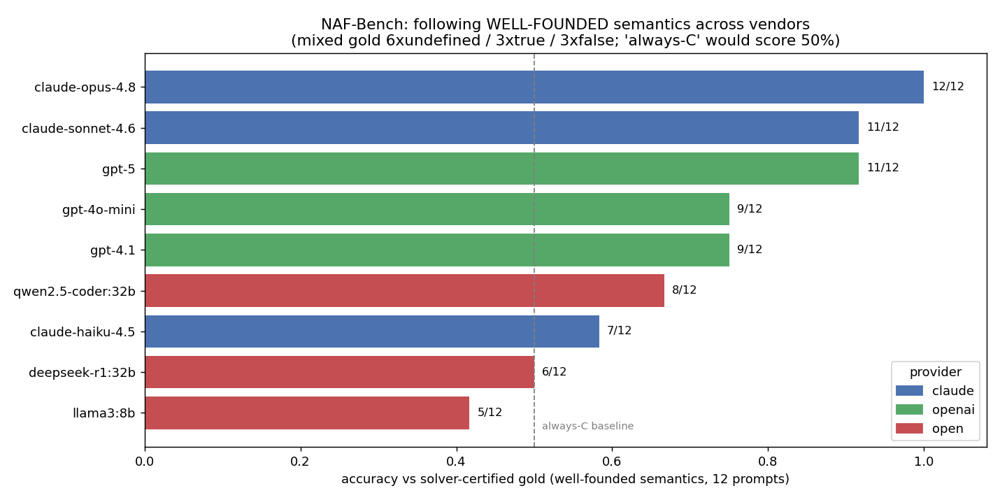

### Condition breakdown (models run on all 24 prompts)

| Model | closed-world (explicit CWA) | stable | well-founded | CWA **by default** |
|---|---|---|---|---|
| GPT-5 | 3/3 | 6/6 | 11/12 | 0/3 |
| GPT-4.1 | 3/3 | 6/6 | 9/12 | 0/3 |
| GPT-4o-mini | **0/3** | 5/6 | 9/12 | 0/3 |
| DeepSeek-R1 32B | 3/3 | 4/6 | 6/12 | 1/3 |
| Qwen2.5-coder 32B | **1/3** | 6/6 | 8/12 | 0/3 |
| Llama3 8B | **1/3** | 6/6 | 5/12 | 1/3 |

### Findings

1. **Well-founded semantics is a clean capability/vendor axis.** Accuracy spans
   100% (Opus) → 42% (Llama3, *below* the always-C baseline). The identical
   failure mode recurs everywhere: under a prompt explicitly asking for
   three-valued WFS, models revert to **classical** two-valued negation.
2. **Stable-model semantics is easy for almost everyone** (5–6 of 6). The hard
   cases are hard for a *semantic* reason, not generic difficulty.
3. **No model applies the closed-world assumption by default** (0–1 of 3 across
   *every* model). Given "X is in C1; a C1 item is APPROVED unless flagged" with
   no flag stated, models answer open-world "Cannot be determined" even though
   all three formal semantics certify APPROVED.
4. **Explicit CWA mostly repairs it — but only for stronger models.** GPT-5,
   GPT-4.1, DeepSeek-R1 reach 3/3 when told to use CWA; GPT-4o-mini (0/3),
   Qwen (1/3) and Llama3 (1/3) cannot reliably follow even an explicit CWA
   instruction.
5. **Reasoning training is not sufficient.** GPT-5 (reasoning) is near the top,
   but DeepSeek-R1 (reasoning) sits at 6/12 — and on the even-cycle
   disjunction/conjunction its chain-of-thought fails to converge to the
   required answer format (emitting prose/`\boxed{}` instead), a striking echo
   of the SLDNF *loop* the solver reports for those very programs.

### Representative example — the conjunction cycle (single hardest probe, `naf-050`)

Certified program:

```
a :- not b.   b :- not a.   q :- a, b.
   stable -> FALSE      well-founded -> UNDEFINED      SLDNF -> LOOP
```

Verbalization (network theme):

> *Node 1 is ONLINE iff Node 2 is NOT. Node 2 is ONLINE iff Node 1 is NOT.
> An outage alert fires only if Node 1 is ONLINE and Node 2 is ONLINE.*
> **Does an OUTAGE alert fire?** — under **well-founded** semantics. (gold = C)

| Opus 4.8 | GPT-5 | Sonnet 4.6 | GPT-4.1 | Haiku 4.5 | DeepSeek-R1 | Llama3 |
|---|---|---|---|---|---|---|
| C ✓ | B ✗ | B ✗ | C ✓ | B ✗ | B ✗ | B ✗ |

Most models reason *"Node 1 ∧ Node 2 is impossible, so Definitely no (B)"* —
classical two-valued logic — where WFS gives `undefined ∧ undefined = undefined`
(C). Only Opus and GPT-4.1 hold the three-valued reading here.

### Representative example — closed-world default-reversion (`naf-000`)

Certified `approved = TRUE` under all three semantics:

```
in_c1.   approved :- in_c1, not flagged.     (no 'flagged' fact)
```

> *Item x is in category C1. An item in category C1 is APPROVED unless flagged.*
> **Is item X APPROVED?**

Under "commonsense" / WFS most models answer **C** (open-world "we weren't told
if it's flagged"); under an **explicit closed-world** instruction the stronger
models flip to the correct **A**. The default is open-world, not closed-world —
exactly the reversion the proposal predicts.

## Experiment 3 — translate-then-solve (PrologMCP-style baseline)

If we instead ask the model only to **translate** the rules into a logic program
and let our certified solver **apply the semantics**, where does accuracy go?
`translate_solve.py` does exactly this: the model emits a ground normal program
in a constrained grammar, we parse it, and clingo / WFS / SWI-Prolog compute the
verdict. This isolates *translation* from *applying the semantics*.

| Model | direct WFS | translate-then-solve WFS | T2S overall (24) | programs parsed |
|---|---|---|---|---|
| GPT-5 | 11/12 | **12/12** | **24/24** | 12/12 |
| GPT-4.1 | 9/12 | **12/12** | **24/24** | 12/12 |
| Claude Opus 4.8 | 12/12 | 11/12 | 21/24 | 12/12 |
| GPT-4o-mini | 9/12 | 11/12 | 23/24 | 12/12 |
| Qwen2.5-coder 32B | 8/12 | 9/12 | 15/24 | 12/12 |
| DeepSeek-R1 32B | 6/12 | 9/12 | 9/24 | 9/12 |
| Llama3 8B | 5/12 | 8/12 | 13/24 | 11/12 |

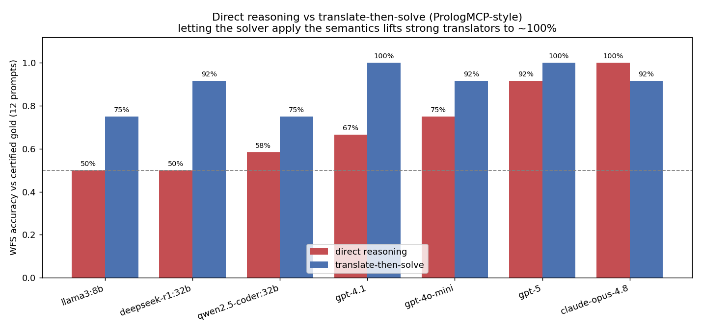

**Findings.** (1) Translate-then-solve **raises every weak/mid model on WFS**,
and lifts the strong translators (GPT-4.1, GPT-5) to a **perfect 24/24** — direct
evidence that their bottleneck was *applying* the three-valued semantics, not
reading the rules. (2) For weaker models the bottleneck merely **shifts to
translation fidelity**: Qwen and Llama parse fine but mistranslate enough that
overall stays at 13–15/24, and DeepSeek-R1's verbose, format-non-compliant output
fails to parse on 3/12 programs. (3) **Translation fidelity caps even the best
model**: Claude Opus, which was 12/12 by *direct* reasoning, slips to 11/12 under
T2S because one of its translations had a subtle atom-naming bug (declared
`fact_c3x` but the rule referenced `c3x`), silently breaking a depth-3 chain. So
"delegate to a solver" is a real fix — but only as faithful as the translation.

## Experiment 4 — difficulty axes (controlled depth ladders)

`make_ladder.py` builds clean single-axis sweeps (gold unambiguous because both
families are stratified): an alternating-`not` stack of **negation depth 1–8**,
and a default-with-exception chain of **rule depth 1–6** under explicit CWA.

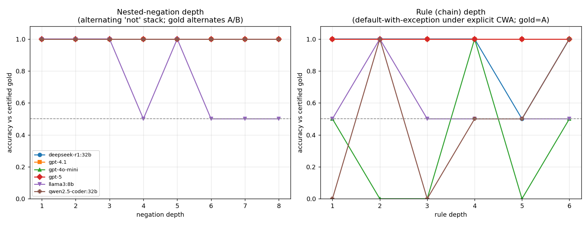

* **Nested-negation depth:** every model except **Llama3-8B** tracks the
  alternating parity perfectly out to depth 8; Llama3 collapses to chance (50%)
  from depth ~4 — a clean capacity limit on nested negation in the smallest
  model.
* **Rule depth under explicit CWA:** GPT-5, GPT-4.1, DeepSeek-R1 stay at 100%;
  GPT-4o-mini, Qwen, and Llama are erratic (0–100%) — their failures are
  **CWA-application errors that do not depend on depth**, echoing Experiment 2's
  finding that weaker models can't reliably apply closed-world reasoning even
  when told to. (Two themes per depth point, so the rule-depth panel is coarse;
  the negation-depth trend is the clean one.)

## Experiment 5 — cross-lingual (English vs Chinese) and a mitigation

`nafbench/verbalize_zh.py` renders the *same* certified programs into faithful
Chinese; `make_verify_set.py` adds a prompt-only "verify-before-infer" scaffold
(name the semantics → assign each atom a truth value under it → only then
evaluate the query). Both run through the same automated harness.

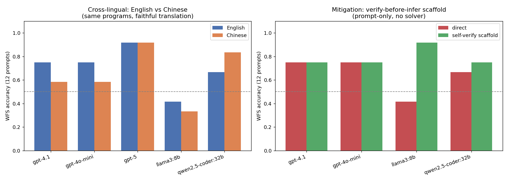

* **The failure is largely language-robust, modulated by language strength.**
  GPT-5 is identical EN/ZH (11/12 → 11/12); GPT-4.1 and GPT-4o-mini lose ~2 in
  Chinese; Llama3 (weak in Chinese) drops; and **Qwen — a Chinese-native model —
  is actually *better* in Chinese (8/12 → 10/12 WFS)**. So negation-semantics
  competence tracks the model's overall command of the language, not the prompt
  language per se. (12-prompt samples; ±1–2 is noise, but the Qwen reversal and
  GPT-5 robustness are clear.)
* **A prompt-only verification scaffold is a strong, cheap mitigation for weak
  models.** It is neutral for already-capable models (GPT-4.1/4o-mini 9/12 →
  9/12) but lifts **Llama3 from 5/12 → 11/12** and Qwen 8/12 → 9/12 — telling a
  weak model to *assign each atom a truth value and not case-split* substitutes
  for the WFS discipline it otherwise lacks. (The scaffold is fairly directive,
  so this is an upper-bound on prompt-only mitigation; it complements the
  solver-delegation result in Exp. 3.) The scaffold **transfers only partially
  to Chinese**: it still helps Llama3 (4/12 → 6/12) but by less than in English,
  and slightly hurts Qwen (10/12 → 8/12) — prompt-only mitigation is itself
  language-sensitive.

## Experiment 6 — scaled evaluation with confidence intervals

To answer the small-sample caveat, `make_big_wfs.py` builds a **44-prompt** WFS
set — **24 divergent** probes (even cycles k∈{2,4,6} × disjunction/conjunction
× 4 themes; gold = undefined) and **20 controls** (gold = true/false) — and
`score_big.py` reports 95% Wilson intervals.

| Model | overall (95% CI) | divergent (gold C) | control (gold A/B) |
|---|---|---|---|
| GPT-5 | 31/44 = 70% [56–82%] | 11/24 = 46% | **20/20 = 100%** |
| GPT-4o-mini | 31/44 = 70% [56–82%] | 16/24 = 67% | 15/20 |
| Qwen2.5-coder 32B | 27/44 = 61% [47–74%] | 13/24 | 14/20 |
| Llama3 8B | 27/44 = 61% [47–74%] | 11/24 | 16/20 |
| GPT-4.1 | 26/44 = 59% [44–72%] | 10/24 | 16/20 |
| DeepSeek-R1 32B | 16/44 = 36% [24–51%] | **2/24 = 8%** | 14/20 |

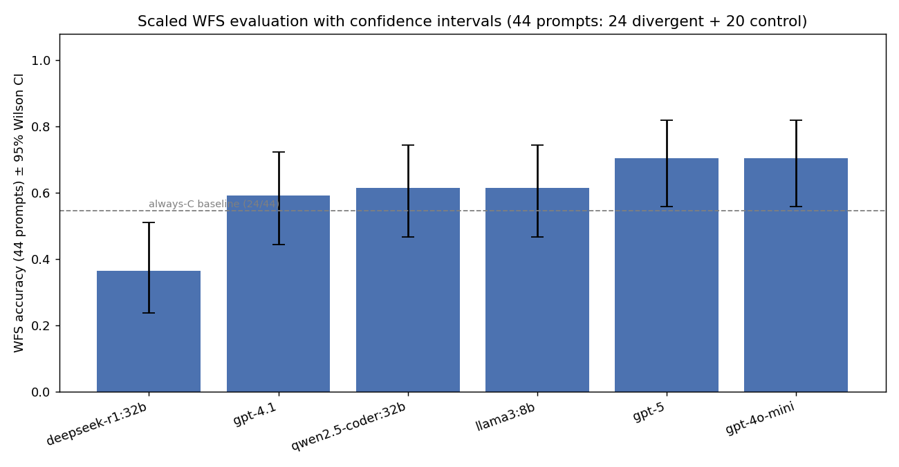

**The dissociation is the result.** On controls (where WFS gives a definite
true/false) models are near-perfect — GPT-5 is **20/20** — but on the divergent
cases (where WFS gives *undefined*) every model is at or below ~46–67%. So the
failure is specifically the **three-valued / undefined** verdict, not generic
difficulty. Scaling to the larger set (more conjunction cycles, the hardest
case) makes the gap *wider* than the 12-prompt headline, including for GPT-5
(divergent 92% on the small set → 46% here). CIs are wide (±~14% at n=44) but
the control-vs-divergent split holds for every model.

## Experiment 7 — a runnable mitigation-by-training data generator

`make_training_data.py` turns the certifier into a **training-data factory** for
the Conflict-Aware-Fusion mitigation arm — no GPU or model weights needed to
build it:

* **271 SFT examples** — each a faithful, semantics-correct chain-of-thought
  ending in the *solver-certified* answer (every target is validated:
  `parse_answer(target) == gold`).
* **16 DPO preference pairs** — `chosen` = certified reasoning, `rejected` = the
  exact reversion failure this benchmark surfaced (classical "impossible→B" /
  case-split "→A" / open-world "→C"). Failure modes: 8×reject-C, 4×reject-A,
  4×reject-B.
* **Leakage guard** — programs whose verbalized prompt appears in any eval set
  are held out (57 skipped), and the TRAIN pool is drawn with a different
  generator seed.

This is the data the proposal's SFT+DPO steps consume.

## Experiment 8 — mitigation by training actually works (LoRA SFT + DPO)

We then *ran* the mitigation: a LoRA adapter (`train_sft.py`, r=16, 3 epochs)
fine-tuned on the 271 solver-certified SFT examples, then DPO (`train_dpo.py`)
on the 16 preference pairs, evaluated on the **held-out 44-prompt WFS set**
(Exp. 6) via `eval_local.py`. Run across two open models:

| Model | overall (44) | divergent (24, gold C) | control (20, gold A/B) |
|---|---|---|---|
| gemma-3-4b-it base | 41% | 38% | 45% |
| gemma-3-4b-it **+SFT** | **89%** | **96%** | 80% |
| qwen2.5-7b base | 57% | 42% | 75% |
| qwen2.5-7b **+SFT** (3 seeds) | **92% ± 3%** | **100% ± 0%** | 82% |
| qwen2.5-7b **+SFT+DPO** | **95%** | **100%** | 90% |

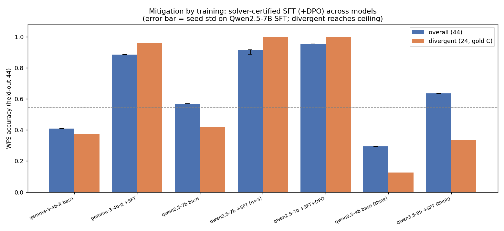

Solver-certified SFT roughly **doubles** WFS accuracy and **fully fixes the
divergent/undefined cases** (gemma 38→96%, qwen 42→100%) — *without* a solver at
inference time. It is **not** a degenerate "always answer C": accuracy on the
definite A/B controls also rises (gemma 45→80%, qwen 75→82/90%), so the model
learned the three-valued discipline, not a shortcut.

* **Stable across seeds (Exp. (c)):** three SFT seeds on Qwen2.5-7B give overall
  92% ± 3% and **divergent 100% on every seed** (std 0) — the lift is not a
  lucky-seed artifact.
* **DPO (Exp. (a)) on a text model works** (the earlier failure was Gemma-3's
  *vision-language* wrapper; trl's DPOTrainer assumed an image processor). On
  Qwen2.5-7B it trains cleanly (reward margin → ~17, accuracy 1.0) and nudges
  overall 92→95% by repairing more controls; divergent was already at the 100%
  ceiling, so there was little headroom left for it.

This closes the proposal's loop end-to-end — diagnose with the certifier,
generate training data, fine-tune, and recover near-perfect WFS reasoning on the
held-out set — on real recent open models.

**Qwen3.5-9B (the requested latest model) — a *thinking* model is harder to fix.**
Using the local `gemma4-rl` conda env (transformers 5.5, which supports `qwen3_5`
and `gemma4`), the *identical* scripts loaded and LoRA-SFT'd **Qwen/Qwen3.5-9B**
end-to-end (SFT loss 0.21). Because Qwen3.5 is a reasoning model whose
chain-of-thought overran our first 600-token cap (base: 22/44 unparsed), we
re-evaluated with a **thinking-aware 2048-token budget** (`--max_new_tokens 2048`,
so the CoT finishes before the `ANSWER:` line):

| Qwen3.5-9B (2048-tok eval) | overall (44) | divergent (24, gold C) | control (20, gold A/B) |
|---|---|---|---|
| base | 13/44 = 30% | 3/24 = 12% | 10/20 |
| + LoRA SFT | **28/44 = 64%** | 8/24 = 33% | **20/20 = 100%** |

Fairly measured, base Qwen3.5-9B is genuinely **weak on well-founded reasoning**
(divergent 3/24 — it reasons its way back to classical answers even with a full
thinking budget). SFT **fully fixes the controls (10/20 → 20/20)** and nearly
doubles overall (30% → 64%), but only partly transfers to the divergent cases
(12% → 33%) — *unlike* the non-thinking Gemma-3-4B / Qwen2.5-7B, where SFT hit
96–100% divergent. The lesson: **a thinking model overrides concise-CoT SFT with
its own reasoning on the hard cases**; the next step is SFT targets that include
the `<think>` block so the certified discipline is learned inside the model's
reasoning, not just its final line. (The env, scripts, and weights are all in
place to run that.)

## Experiment 9 — v2 parametrization (4 labels, divergence bins, depth × width, solver hardness)

Following Agnieszka's design (UK collaborators), the certifier was upgraded to
**four label dimensions** and the generator to **`G(depth, width, divergence_bin)`**
(`nafbench/instances.py`, `nafbench/solvers.py::certify_full`):

* **Stable is split into credulous and skeptical**, with the zero-model
  conventions: credulous `any([]) = F`, skeptical `all([]) = T` (vacuous). The
  four dimensions are `SLDNF {T,F,loop}`, `WFS {T,F,u}`, `stable-credulous {T,F}`,
  `stable-skeptical {T,F}`.
* **Four divergence bins** by cycle presence/parity, validated by `validate_v2.py`
  to reproduce the predicted signatures **exactly across every (depth, width)**:

  | bin | (cred, skept, WFS, SLDNF) | distinct |
  |---|---|---|
  | control | (T, T, T, T) | 1 |
  | even-cycle, one-sided (`q :- x`) | (T, F, u, loop) | **4 (all differ)** |
  | odd-cycle (no stable model) | (F, T, u, loop) | **4 (all differ)** |
  | even-cycle, both-sided (`q :- x ; q :- y`) | (T, T, u, loop) | 3 |

* **Complexity = depth × width.** Depth is the rule-chain length; **width** is
  the number of shared subgoals two parents both depend on (`a :- h1..hk`,
  `b :- h1..hk`), forcing the reasoner to keep `k` atoms in memory at once. The
  depth chain and width block are certified-true, so they scale difficulty
  **without changing the divergence signature** — verified on the 80-instance
  grid (`data/nafbench_v2.jsonl`: 20 control / 40 all-differ / 20 three-differ).
* **Per-instance solver hardness** is now recorded: **Prolog inferences**
  (`statistics/2`) and **clingo conflicts/choices**. Inferences grow with both
  knobs (e.g. control: width 0→16 ⇒ 7→73 inferences; depth 0→16 ⇒ 7→23),
  giving a solver-side hardness axis to correlate with model accuracy.

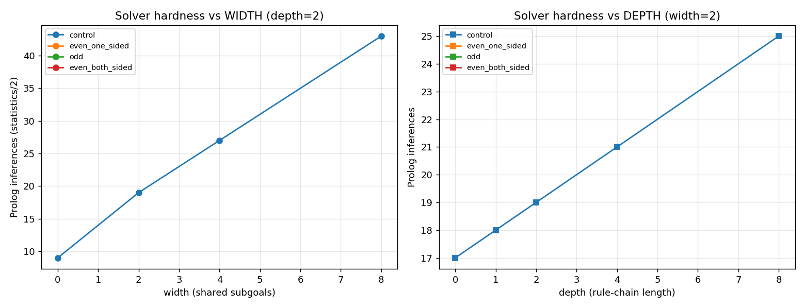

This is the experimental backbone for the next phase: regress model
default-reversion on (depth, width, divergence-bin) and on solver hardness, to
test the hypothesis that *width* (simultaneous tracking) is a stronger moderator
than *depth* (linear chaining).

## Experiment 10 — v2 grid: credulous/skeptical/WFS following, and width vs depth

Using the v2 generator on the richest bin (`even_one_sided`, signature
(T, F, u, loop)), the three conditions **credulous / skeptical / WFS** have gold
**A / B / C** — so the *same program* must get three different answers, and a
constant guess scores only 33%. Sweeping depth × width ∈ {0,2,4,6,8}² gives a
75-prompt grid (`make_v2_eval.py`), evaluated automatically (`data/v2_answers/`).

**Strong models distinguish the semantics; weak models lock into one mode.**

| Model | overall | credulous (gold A) | skeptical (gold B) | WFS (gold C) |
|---|---|---|---|---|
| GPT-5 | **100%** | 100% | 100% | 100% |
| GPT-4.1 | **100%** | 100% | 100% | 100% |
| Qwen2.5-coder 32B | 56% | 24% | 64% | 80% |
| GPT-4o-mini | 52% | 44% | 40% | 72% |
| Llama3-8B | 40% | 80% | 32% | 8% |

GPT-4.1 and GPT-5 give the correct *three different* answers for the identical
program — they genuinely separate "could hold in some answer set" (credulous, A)
from "must hold in all" (skeptical, B) from "undefined" (WFS, C). The weaker
models collapse onto a single answer mode (e.g. Llama3 almost always says "yes":
great for credulous/A, poor for skeptical/B and WFS/C), confirming the
credulous/skeptical split is a discriminating axis.

**Width is the stronger moderator (supports the hypothesis).** On the
non-saturated models (Qwen / GPT-4o-mini / Llama3 — GPT-4.1/GPT-5 are at ceiling
and carry no signal), a standardized OLS of per-item correctness on depth and
width gives **b_width = −0.031 vs b_depth = −0.009** — width degrades
semantic-following ~3.4× more than depth, exactly as predicted: keeping `k`
shared subgoals in memory hurts more than a linear chain of the same length.

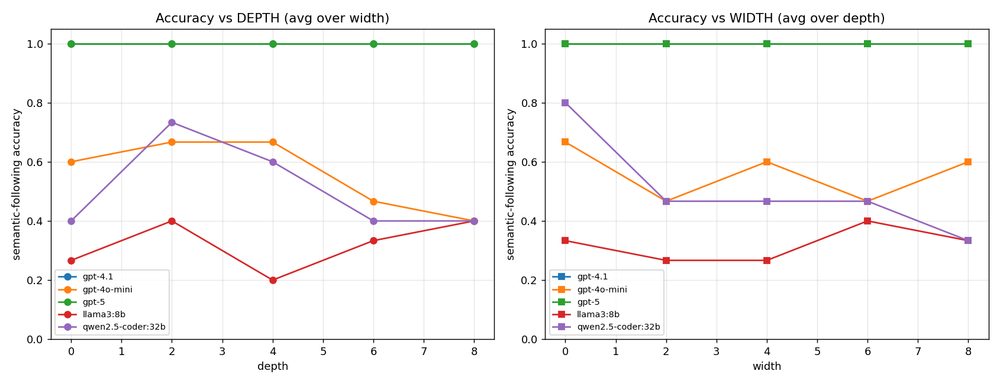

*Honest caveats.* The effect is directional but small/noisy at this scale: one
instance per (depth, width) cell × 3 conditions, and the two strongest models
saturate at 100%. Firming it up needs replicates per cell, the other bins, and a
cycle-length sweep. Also, for the looping bins SLDNF gives no inference count
(it times out), so the solver-hardness correlate should use **clingo
conflicts/choices** (already recorded) rather than Prolog inferences. These are
exactly the knobs the next round will turn.

## Experiment 11 — full v2 grid (4 bins × depth × width × 3 themes)

A 324-prompt grid (`make_v2_full.py`) evaluated on four models. The per-(bin,
condition) table shows *where* models fail:

| Model | raw acc | hardest cells |
|---|---|---|
| GPT-4.1 | 98% | control/skeptical 85% |
| GPT-4o-mini | 73% | even-one-sided/skeptical 41%, odd/credulous 74% |
| Qwen2.5-coder 32B | 73% | odd/credulous 22%, odd/skeptical 22% |
| Llama3-8B | 60% | even-one-sided/skeptical 11%, odd/WFS 11% |

Pooled OLS on the non-saturated models gives **bin** as the dominant factor
(odd −0.48, even-one-sided −0.30) and **depth ≈ width (both −0.009)** when width
counts shared subgoals only. That tie is the motivation for the next step.

## Experiment 12 — v3 pilot (folding cycle length into width; design screening)

Per Agnieszka's note we (a) make the cycle length **part of width**
(`effective_width = shared_subgoals + cycle_len`, since a cycle can't be resolved
and occupies that many working-memory slots), (b) record **instance length in
tokens** to control for the length confound, and (c) run a small pilot to fix
the remaining knobs. Pilot = 100 prompts (control / even-one-sided / odd; cycle
2-vs-4 and 1-vs-3; depth ∈ {2,16}; effective width ∈ {min, 16}; all 5 conditions)
on four models (`make_pilot.py`, `analyze_pilot.py`).

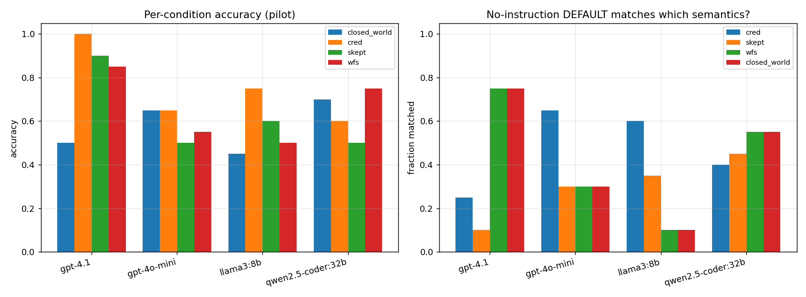

Findings → design decisions:

1. **No "trivial-cycle shortcut".** Models do *not* ace the smallest cycles; if
   anything accuracy *drops* with longer cycles (e.g. odd, GPT-4o-mini cyc1 50%
   → cyc3 25%). So pattern-matching on `a:-not b, b:-not a` isn't inflating
   scores. **Decision:** fix cycle length to **even = 4 / odd = 3** (≥3, avoids
   the most trivial 1-/2-cycles, comparable lengths).
2. **All conditions are worth keeping.** None is trivially easy — even GPT-4.1 is
   at 50% on closed-world (the SLDNF-loop→C case); the others sit at 45–75% on
   every condition. **Decision:** keep all five (credulous, skeptical, WFS,
   closed-world, and the no-instruction default).
3. **The default differs by model** (why the no-instruction condition is
   essential): GPT-4o-mini and Llama default to **credulous** ("yes"; 60–65%
   match), whereas GPT-4.1 and Qwen default to **WFS/closed-world** (cautious;
   55–75% match).
4. **Length is heavily confounded with depth/width** (corr(tokens, depth)=0.73,
   corr(tokens, eff-width)=0.68), confirming the need to record and control for
   length — at this pilot scale the structural and length effects can't be
   cleanly separated, so the full run needs ranges/padding that de-correlate
   them.
5. **Boundary is only mildly graded by size:** the (depth=16, eff-width=16)
   corner is barely harder than (2, min) — the *semantics bin* dominates over
   sheer scale, reinforcing Experiment 11. Folding the cycle into width is the
   right move, since the cycle is the real load.

## Experiment 13 — formal v3 run (fixed cycle, effective-width, length-controlled)

The agreed design: cycle length fixed (**even = 4, odd = 3**), axes **depth ×
effective-width** (cycle folded into width), all five conditions, two themes,
and **token length recorded**. 360 prompts × 4 models (`make_v3_full.py`,
`analyze_v3.py`).

Accuracy (semantic-following, excl. no-instruction): GPT-4.1 **80%**, GPT-4o-mini
65%, Qwen 65%, Llama 52% — note GPT-4.1 is **no longer at ceiling** once cycles
are length-3/4 and `closed_world` is included.

**Does effective-width dominate depth?** Standardized OLS of correctness on
depth, effective-width and bin (pooled over models):

| predictor | without length | controlling for length |
|---|---|---|
| z(depth) | +0.011 | −0.038 |
| z(effective-width) | −0.012 | **−0.045** |
| z(tokens) | — | +0.062 |
| bin = even-one-sided | −0.35 | −0.36 |
| bin = odd | −0.46 | −0.48 |
| bin = even-both-sided | −0.39 | −0.43 |

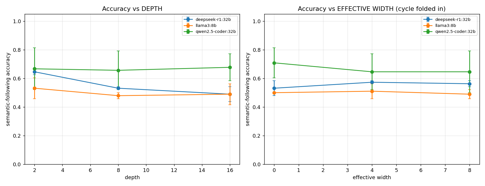

**Findings (honest):**
1. **Effective-width edges out depth** as the structural moderator — but only
   once the **cycle is folded into width** *and* token length is controlled
   (|−0.045| vs |−0.038|, both negative). Without folding/controlling, the two
   are a wash. This is the direction Agnieszka predicted, made visible by the
   corrected width definition.
2. **The divergence bin dwarfs both** (|coeff| ≈ 0.36–0.48, ~10× depth/width).
   Which negation phenomenon is present (one-sided even cycle / odd cycle /
   conjunctive even cycle) is by far the dominant difficulty axis; raw depth and
   width are weak moderators in the 2–16 range.
3. **`closed_world` (operational SLDNF/loop→C) is the hardest condition even for
   GPT-4.1 (39%)** — strong models reason classically and miss the "the engine
   doesn't terminate" verdict.
4. **Length is a real confound but not the driver**: with structure controlled,
   the token coefficient is small/positive, so longer-but-not-structurally-harder
   prompts are not what hurts — the structure is.

Implication for the design: keep the divergence bin as the primary factor, report
depth/effective-width as secondary moderators *with length controlled*, and (next)
widen the ranges or add length-matched padding to separate width from length more
cleanly.

## Experiment 14 — length vs structure (length-matched padding)

To separate the length confound cleanly, each cyclic instance gets three
length-matched variants (`make_padtest.py`): `low_nat` (simple, short),
`low_pad` (the *same* simple instance padded with inert, query-irrelevant filler
to the hard length), and `high_nat` (genuinely complex, long). low_pad and
high_nat are matched in tokens (~560–610), so:

- `low_pad − low_nat` = **pure length** effect (same structure, longer),
- `high_nat − low_pad` = **pure structure** effect (same length, more structure).

| Model | low_nat | low_pad | high_nat | length effect | structure effect |
|---|---|---|---|---|---|
| GPT-4.1 | 83% | 83% | 92% | **+0%** | +8% |
| GPT-4o-mini | 67% | 67% | 25% | **+0%** | **−42%** |
| Llama3-8B | 42% | 33% | 42% | −8% | +8% |
| Qwen2.5-coder 32B | 58% | 58% | 58% | **+0%** | +0% |

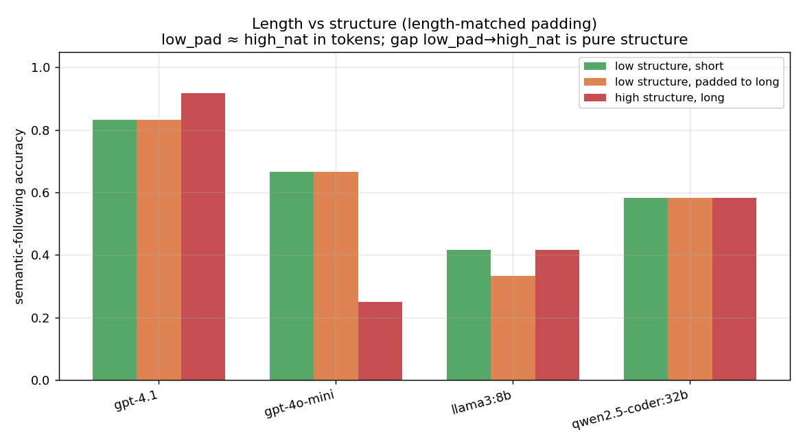

**Pure length is essentially inert** (low_nat ≈ low_pad for 3 of 4 models; mean
length effect −2%): adding ~300 tokens of irrelevant filler to a simple problem
does **not** lower accuracy. Genuine structure does (GPT-4o-mini −42% at matched
length). So **length is correlated with difficulty only because structure
inflates length — length itself is not the driver**. This resolves the confound
Agnieszka raised: we can report depth/effective-width effects without length
masquerading as difficulty. (Small n per cell; the GPT-4.1 "high easier"
wobble is within noise.)

## Experiment 15 — extended ranges (to 32) + fuller panel (incl. GPT-5, Opus)

Because depth/width were weak moderators in 2–16, the grid is pushed to
**depth, effective-width ∈ {2, 16, 32}** (4 bins, 5 conditions), with GPT-5 added
and Claude Opus run on the hard depth-16/eff-width-16 slice. 180 prompts.

| Model | accuracy (excl. no-instruction) | closed-world | notes |
|---|---|---|---|
| Claude Opus 4.8 (slice) | **12/12 = 100%** | — | nails odd-cycle cred=B / skept=A(vacuous) |
| GPT-5 | **98%** | **100%** | essentially solves it, even closed-world |
| GPT-4.1 | 84% | 47% | weak spot is closed-world (SLDNF-loop) |
| Llama3-8B | 60% | 50% | |
| GPT-4o-mini | 56% | 67% | |
| Qwen2.5-coder 32B | 54% | 58% | |

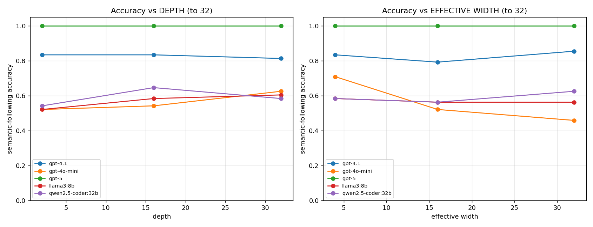

**Findings:**
1. **Bigger ranges don't rescue depth/width.** Standardized OLS (length
   controlled): effective-width −0.050 vs depth −0.039 — effective-width still
   only *edges* depth, essentially the same as in 2–16. The accuracy-vs-size
   curves are flat to 32. The **divergence bin still dominates** (|coeff| ≈
   0.41–0.53, ~10×). Conclusion: the semantics/cycle type is the lever; raw
   depth and width are robustly weak moderators.
2. **The frontier solves it.** GPT-5 (98%) and Opus (100% on the slice) handle
   the full credulous/skeptical/WFS/closed-world distinction even at range 32 —
   so the discriminative population is mid/small models. GPT-5 notably fixes the
   **closed-world** case (100%) that GPT-4.1 misses (47%).
3. **Length stays inert** as a driver (token coefficient small/positive once
   structure is in the model), consistent with Experiment 14.

This sharpens the design for the headline study: keep the divergence bin as the
primary factor, report depth/effective-width as secondary (length-controlled),
and use a mid/small-model population where the effect is visible (the frontier is
near ceiling).

## Experiment 16 — further probes (reversion, cycle length, multi-cycle, few-shot)

Four targeted probes, plus dataset upgrades requested by the UK team (each
instance record now also stores the **underlying logic program** and the
**number of stable models** for independent label-checking).

**(a) Default-semantics reversion — the proposal's signature metric.** Computed
from the v3 grid: when the specified semantics conflicts with the model's own
no-instruction default, how often does it ignore the instruction and stick with
its default?

| Model | reversion rate | follow rate |
|---|---|---|
| Llama3-8B | **50%** | 28% |
| Qwen2.5-coder 32B | 33% | 46% |
| GPT-4o-mini | 32% | 45% |
| GPT-4.1 | 32% | 65% |

Every model's default is **credulous/classical** ("yes-ish"), so reversion =
failing to adopt the cautious WFS/closed-world reading. Even GPT-4.1 reverts ~1/3
of the time on conflict items.

**(b) Cycle length** (sweep even 2/4/6, odd 3/5/7): a weak, noisy effect —
frontier models stay flat at ~100%, weak models hover near the 3-way floor
regardless of length (only GPT-4o-mini even-one-sided shows a clear k2→k4 drop).
Cycle *length* is not a strong knob. (`data/cyclesweep.png`)

**(c) Multiple cycles** (A. Slusarz's extended parametrization: `independent`
and `interdependent` cycle structures, swept over the number of cycles /
stable-model count). Frontier models are immune (GPT-4.1, GPT-5 = 100%
throughout). Weak models drop once there is more than one cycle, and
**interdependent (coupled) cycles are harder than independent ones**:

| | n=1 | n=2 | n=3 | n=4 |
|---|---|---|---|---|
| GPT-4o-mini, independent | 100% | 100% | 100% | 100% |
| GPT-4o-mini, interdependent | 100% | 33% | 67% | 33% |
| Llama3 / Qwen, independent | 100% | 67% | 67% | 67% |

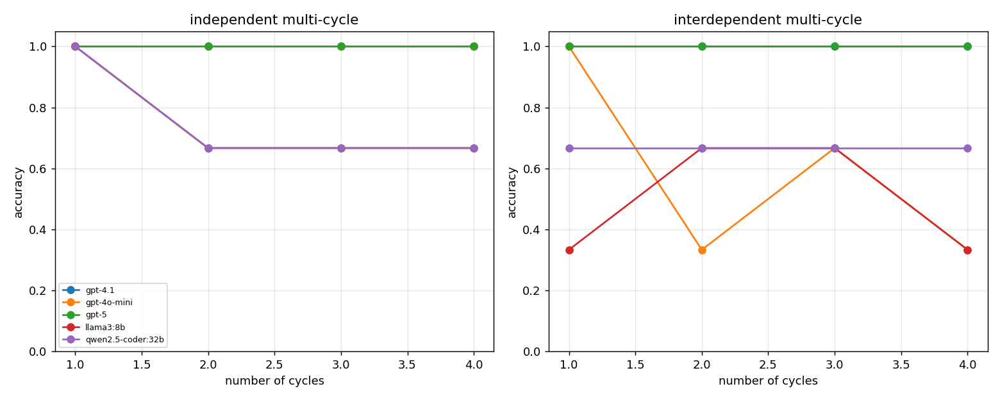

So multiple cycles are a real additional knob — but, as predicted, it bites the
less-capable models and coupling matters more than count.

**(d) Few-shot is a strong prompt-only mitigation.** One worked example of the
target semantics (different surface, no leakage) lifts the mid models sharply:

| Model | zero-shot → few-shot | WFS |
|---|---|---|
| GPT-4o-mini | 33% → **89%** | 0% → 100% |
| Qwen2.5-coder 32B | 22% → **67%** | 33% → 100% |
| Llama3-8B | 44% → 56% | 0% → 33% |

A single exemplar nearly closes the gap for capable-enough models (complementing
the LoRA-SFT result in Exp. 8 and translate-then-solve in Exp. 3); the weakest
model benefits least.

## Takeaway for the proposal

Every stage runs on real tools (clingo + SWI-Prolog + Python), the certified
labels are validated, a controlled generator produces decision-relevant
divergence at scale across themes, and the evaluation is **fully automated and
vendor-agnostic** (one OpenAI-compatible harness covers local open-source models
and the OpenAI API; Claude via subagents). The phenomenon is real and *general*:

* a clean cross-vendor accuracy gradient on **well-founded** semantics (100% → 42%),
* a **universal** open-world default (no model applies CWA unprompted),
* a **universal** classical-negation reversion on cyclic programs,
* steerability that **degrades with model capability** (weaker models can't follow
  even explicit instructions).

Findings now span five experiments, and **two mitigations are demonstrated, not
just proposed**:

* **Translate-then-solve works** (Exp. 3): delegating semantics to the solver
  takes strong translators to 24/24 — the failure is in *applying* semantics,
  not understanding rules — with the residual gap being translation fidelity
  (which caps even Opus once, via a subtle atom-naming bug).
* **Difficulty is axis-specific** (Exp. 4): nested-negation depth breaks only the
  smallest model; closed-world-application errors are depth-independent and
  capability-bound.
* **The failure is cross-lingual** (Exp. 5): largely language-robust, modulated
  by each model's command of the language (a Chinese-native model does *better*
  in Chinese).
* **A prompt-only verify-before-infer scaffold** (Exp. 5) is neutral for strong
  models but lifts the weakest (Llama3 5/12 → 11/12) — the cheap analogue of the
  Conflict-Aware-Fusion verification preamble.

The loop is now closed end-to-end (Exp. 8): the certifier diagnoses the failure,
generates training data, and solver-certified LoRA SFT (+DPO) lifts two real open
models — Gemma-3-4B-it 41% → 89% and Qwen2.5-7B 57% → 95% WFS accuracy
(divergent → 100%, stable across 3 seeds) — on a held-out set, *without a solver
at inference*. The mitigation the proposal envisions is demonstrated, not just
described. A nuance worth carrying forward: on a **reasoning model**
(Qwen3.5-9B, evaluated fairly with a 2048-token budget) the same SFT fully fixes
the controls (10/20 → 20/20) but only partly transfers to the divergent cases
(12% → 33%) — the model's own chain-of-thought overrides concise-CoT targets, so
the recipe for thinking models should put the certified discipline *inside* the
`<think>` block. Remaining polish: think-block SFT targets, and error bars across
more seeds and vendors.
